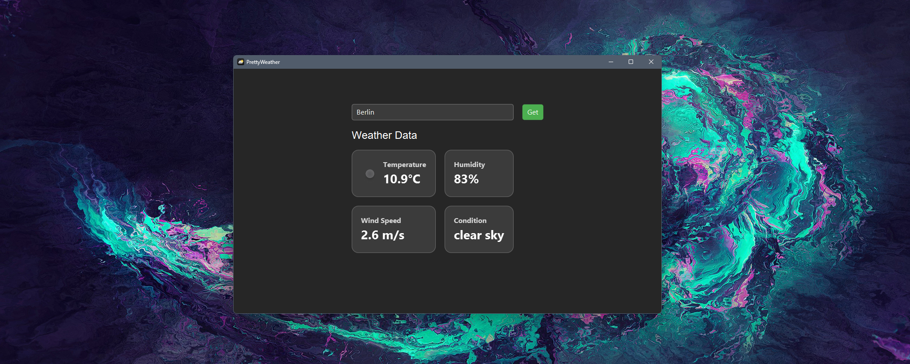

# 🌦️ PrettyWeather

**PrettyWeather** is a modern JavaFX weather application that displays real-time weather data such as temperature, humidity, wind speed, and weather conditions using the **OpenWeather API**.

## 🚀 Features
- **Temperature**, **Humidity**, **Wind Speed**, and **Weather Conditions** displayed in custom tiles.
- Search for any city to get live weather updates.

## 📸 Screenshot

> 

---

## 🌐 Prerequisites

- **Java 11+** is required.
- An API key from [OpenWeatherMap](https://openweathermap.org/).

## 📝 Setup Instructions

1. **Clone the Repository**:

   ```bash
   git clone https://github.com/your-username/PrettyWeather.git
   cd PrettyWeather
   ```

2. **Register for an OpenWeatherMap API Key**:

    - Go to [OpenWeatherMap](https://home.openweathermap.org/users/sign_up) and sign up.
    - After logging in, create a new API key from your account dashboard.
    - Copy the API key provided.

3. **Set the API Key as an Environment Variable**:

   You'll need to set the OpenWeather API key as an environment variable called `OPENWEATHER_API_KEY`. Here’s how to do it:

   ### On Windows:
    1. Open the **Start Menu** and search for **Environment Variables**.
    2. Select **Edit the system environment variables**.
    3. Click **Environment Variables**.
    4. Under **User Variables**, click **New** and set the following:
        - **Variable Name**: `OPENWEATHER_API_KEY`
        - **Variable Value**: your_api_key_here
    5. Click **OK** to save.

   ### On macOS/Linux:
   Open your terminal and run:

   ```bash
   export OPENWEATHER_API_KEY=your_api_key_here
   ```

   To make this permanent, you can add the line above to your `~/.bashrc`, `~/.zshrc`, or `~/.bash_profile` depending on your shell.

4. **Run the Application**:

    - Open the project in your favorite IDE (e.g., IntelliJ IDEA).
    - Run the `HelloApplication.java` file to launch the app.

---

## ⚙️ Technologies Used
- **JavaFX**: For building the user interface.
- **OkHttp**: For handling HTTP requests to the OpenWeather API.
- **Gson**: For parsing JSON responses from the API.
- **CSS**: For styling the user interface with glassmorphism effects.

---

## 🛠️ Future Improvements
- Add more languages for global accessibility.
- Add the ability to search for weather by geographic coordinates (latitude/longitude).
- Display weather forecast for multiple days.

---
